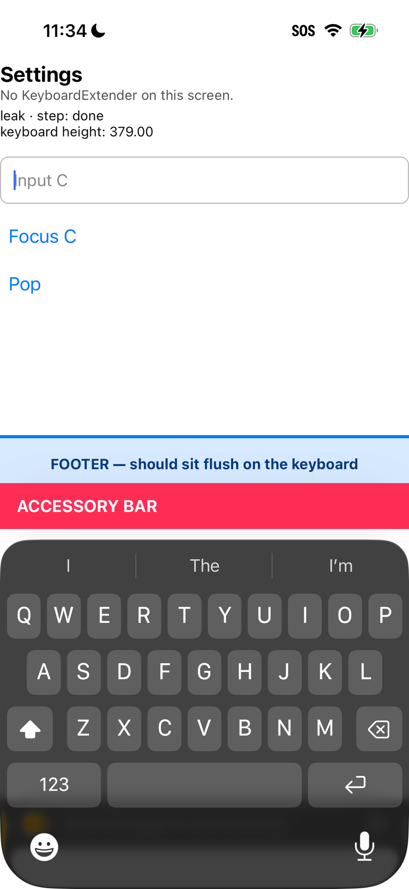

# `KeyboardExtender` attaches its accessory to inputs on other screens

react-native-keyboard-controller **1.22.4**, iOS, new architecture.

`KeyboardExtenderManager` observes `UITextFieldTextDidBeginEditingNotification`
with `object:nil` — every text input in the process — and attaches its shared
accessory container to whichever input begins editing, as long as `enabled` is
`YES`.

Nothing scopes that to the extender's own screen. In a navigation stack the
screen underneath stays mounted, so its extender is still alive and still
observing. Focus an input on the screen pushed on top and the bar is attached to
it, even though that screen has no `KeyboardExtender` at all.

The extender's bar is then drawn above the keyboard on that screen, and the
keyboard frame reports its height. Anything positioned off keyboard height — a
fixed footer, a sticky button — sits that much too high, and stays there.



The screen's own subtitle reads "No KeyboardExtender on this screen." The pink bar
below the footer belongs to the Editor screen underneath, which the user has
navigated away from.

## Reproduction

```sh
cd RnkcRepro
npm install
(cd ios && pod install)
npm start                 # one shell
npm run ios               # another — or build to a device from Xcode
```

`App.tsx` plays the sequence by itself ~1.5s after launch:

1. Focus **Input A** on the Editor screen, which has a `KeyboardExtender`.
2. Push **Settings**, which has no extender. Editor stays mounted underneath.
3. Focus **Input C** on Settings.

The extender's bar appears above the keyboard on Settings. The footer, positioned
off the reported keyboard height, sits a bar's height above the keyboard instead of
flush against it, and stays wrong on every later focus.

Set `SCENARIO = 'control'` for the same navigation with the extender never
mounted.

## Measurements

iPhone 16, iOS 26.5. Bar is 44pt.

| | Reported keyboard height |
| --- | --- |
| `control` — no extender mounted | **335.00** |
| `leak` — extender mounted on the screen below | **379.00** |

`379.00 − 335.00 = 44`, the bar.

## What the logs show

`AccessoryProbe` in `ios/RnkcRepro/AppDelegate.swift` logs every text input, the
`inputAccessoryView` it holds, and how many React-managed views that container
holds. Run `scripts/variant.sh stock log` for the extender's own lifecycle lines.

```sh
xcrun devicectl device process launch --device <udid> --console <bundle-id>
```

Focusing Input C on Settings (`evidence/leak.log`):

```
UITextField(Input C)@0x…a800 firstResponder=true inputAccessoryView=nil
extender handleDidBeginEditing self=0x12303dc00 enabled=1 input=0x…a800
keyboardHeight=379.00 (willShow)
UITextField(Input C)@0x…a800 inputAccessoryView=ModernContainerView@0x…3000
    frame=(0.0, 0.0, 393.0, 44.0) subviews=3 contentViews=3
```

Read in order:

- Input C starts clean — `inputAccessoryView=nil`.
- The Editor's extender, still mounted and `enabled=1`, receives the notification
  for C and attaches to it.
- The container has `contentViews=3` and is 44pt tall: live content from a screen
  the user has navigated away from.
- The reported keyboard height is 379.00, and stays 379.00 after dismissing and
  refocusing.

Input C is a different object from Input A, so no view recycling is involved.

## Scope

This repro isolates one mechanism: an enabled extender attaching to inputs it does
not own, because its observer is registered with `object:nil`. No view recycling
is involved and `detachInputAccessoryView` is never reached.

Other ways an input can end up holding a stale accessory are real and are simply
not what this repro exercises — in particular a Fabric input that is recycled while
carrying an `inputAccessoryView`, and an input that resigns first responder before
detach runs. Nothing here argues against fixing those; the sections below say only
that fixing them does not fix this.

## A detach-side fix does not address this

Making `detachInputAccessoryView` clear from every input it has attached to,
rather than only `[UIResponder current]`, is a real improvement and worth doing on
its own merits — but it does not help here. Detach is never called: the extender is
still enabled and is deliberately attaching.

`scripts/variant.sh detach-patch log`, same sequence (`evidence/leak-with-detach-patch.log`):

```
extender handleDidBeginEditing self=0x116407100 enabled=1 input=0x…e300
keyboardHeight=379.00 (willShow)
UITextField(Input C)@0x…e300 inputAccessoryView=ModernContainerView@0x…4900
    frame=(0.0, 0.0, 393.0, 44.0) subviews=3 contentViews=3
```

Unchanged.

## Environment

| | |
| --- | --- |
| Device | iPhone 16, iOS 26.5 (physical) |
| Desktop OS | macOS 26.6.2 |
| Xcode | 26.1.1 (17B100) |
| React Native | 0.81.6 |
| Architecture | new / Fabric |
| JS engine | Hermes |
| react-native-keyboard-controller | 1.22.4 |
| react-native-reanimated | 3.19.1 |

`react-native-reanimated` is a required peer of RNKC 1.22.4; npm resolves it to
4.6.0, which needs RN 0.83–0.87, so it is pinned to 3.19.1.

Device builds need your own signing team; nothing team-specific is committed here.
